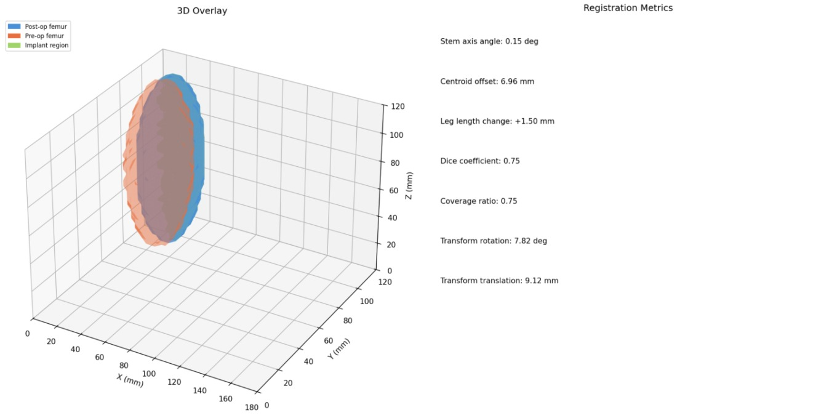
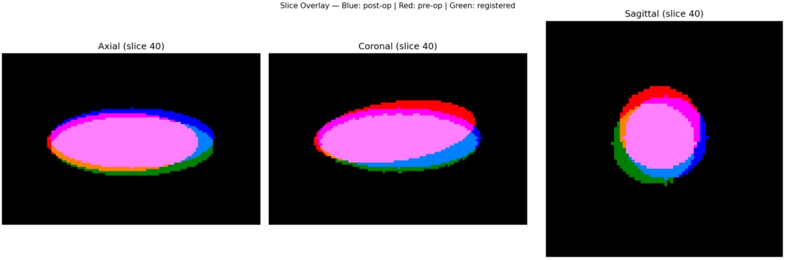
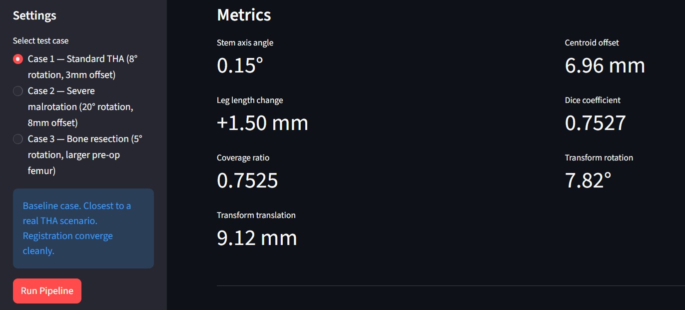

# AutoRegCT

Two years ago, during the practical project for my bachelor thesis, I spent a lot of time processing hip CT scans by hand in 3D Slicer and ImFusion. Segmenting the femur manually, aligning pre-op and post-op scans, reading off measurements one by one. Even for a single patient it took 20-30 minutes, and the results shifted depending on how carefully you did each step. This project automates that.

One thing that made it harder was the metal artifacts in the post-op scans. The implant causes streak artifacts that corrupt the image around the femur, and I had to use the scissors tool in 3D Slicer to remove them manually before segmentation. It was never perfect. That's part of why I added a metal artifact simulation to the validation — to see how the registration holds up when the image is already corrupted.

Given a pre-op and post-op CT from the same THA patient, AutoRegCT segments the femur from both scans, registers the pre-op bone into the post-op space, and computes implant positioning metrics without any manual steps.

---

## What it does

1. Loads pre-op and post-op CT — DICOM folder or NIfTI file
2. Segments the femur using TotalSegmentator
3. Rigidly registers the pre-op femur to post-op space (SimpleITK, Mattes mutual information, 3-level pyramid)
4. Computes 7 positioning metrics from the aligned masks
5. Generates a 3D overlay and slice view

There's also a Streamlit GUI for running synthetic test cases directly in the browser.

---

## Installation
```bash
git clone https://github.com/mohammedaouad/AutoRegCT.git
cd AutoRegCT
```

**Windows** — just double-click `launch.bat`. It creates a virtual environment, installs everything, and opens the GUI. First run takes a few minutes.

**Manual:**
```bash
pip install -r requirements.txt
python -m streamlit run app.py
```

Python 3.10+ required. TotalSegmentator downloads model weights (~1GB) on first use.

---

## CLI usage
```bash
python scripts/run_pipeline.py \
    --preop  /data/patient01/preop/ \
    --postop /data/patient01/postop/ \
    --side   right \
    --out    /data/patient01/results/
```

| Flag | Description |
|---|---|
| `--side` | `left` or `right` — required |
| `--fast` | TotalSegmentator fast mode, lower accuracy but much quicker |
| `--device` | `cpu` or `gpu` |
| `--skip-seg` | Reuse existing masks from a previous run |
| `--save-volumes` | Also write the registered CT volume to disk |
| `--verbose` | Print registration iteration logs |
| `--no-vis` | Skip visualization |

---

## Metrics

| Metric | What it measures |
|---|---|
| `stem_angle_deg` | Angle between pre-op and post-op femur axes |
| `centroid_offset_mm` | Distance between femur centroids after registration |
| `leg_length_change_mm` | Change in femoral length (LLD) along the mechanical axis |
| `dice` | Overlap between registered pre-op and post-op masks |
| `coverage_ratio` | Fraction of pre-op femur covered by post-op mask |
| `transform_rotation_deg` | Total rotation applied by the registration |
| `transform_translation_mm` | Total translation applied by the registration |

If Dice drops below 0.4 or centroid offset exceeds 30mm the pipeline prints a warning.

---

## Validation

No public pre/post-op THA CT dataset was available, so I validated on synthetic data — ellipsoids with known transformations applied. Four test cases are available in the GUI:

| Case | Setup | Result |
|---|---|---|
| Standard THA | 8° rotation, 3mm offset | Transform rotation recovered: 8.03°, stem axis angle: 0.91° |
| Severe malrotation | 20° rotation, 8mm offset | Transform rotation recovered: 17.95°, optimizer still converged |
| Bone resection | 5° rotation, larger pre-op femur | Dice 0.59 — lower because the shapes changed, not the registration |
| Metal artifacts | 8° rotation + streak artifacts on post-op | Transform rotation recovered: 7.56°, Dice 0.87 — registration held up |

The metal artifact case came from a real problem. In my thesis work, post-op CT scans had streak artifacts around the implant that I had to remove manually with the scissors tool in 3D Slicer before segmentation. It was never perfectly clean. The artifact simulation here mimics that — high intensity spikes radiating from the implant center — and the registration still converged cleanly using Mattes mutual information, which handles intensity corruption better than mean squares.

Real CT validation is in progress using private THA data.

---

## Running tests
```bash
pytest tests/
```

Covers: registered mask not empty, rotation recovered within 1° of ground truth, all 7 metric keys present, Dice above 0.5, resampling output shape correct.

---

## Stack

- **SimpleITK** — image I/O, resampling, rigid registration
- **TotalSegmentator** — femur segmentation (nnU-Net)
- **NumPy / SciPy** — SVD axis fitting, rotation math
- **scikit-image** — marching cubes for 3D mesh rendering
- **Matplotlib** — slice overlay and 3D visualization
- **Streamlit** — local browser GUI

---

## Notes

Registration uses Mattes mutual information rather than mean squares. It handles intensity differences between pre and post-op scans better, and as Case 4 shows, it's also more robust to local intensity corruption from artifacts. The 3-level pyramid (4x → 2x → 1x) helps avoid local minima before refining at full resolution.

The implant region in the 3D overlay is `postop AND NOT registered_preop`. On real data this approximates where the prosthesis sits, though it also picks up bone remodeling and positioning differences.

## Example Results

### 3D Overlay


### Slice Overlay


### Metrics Output

